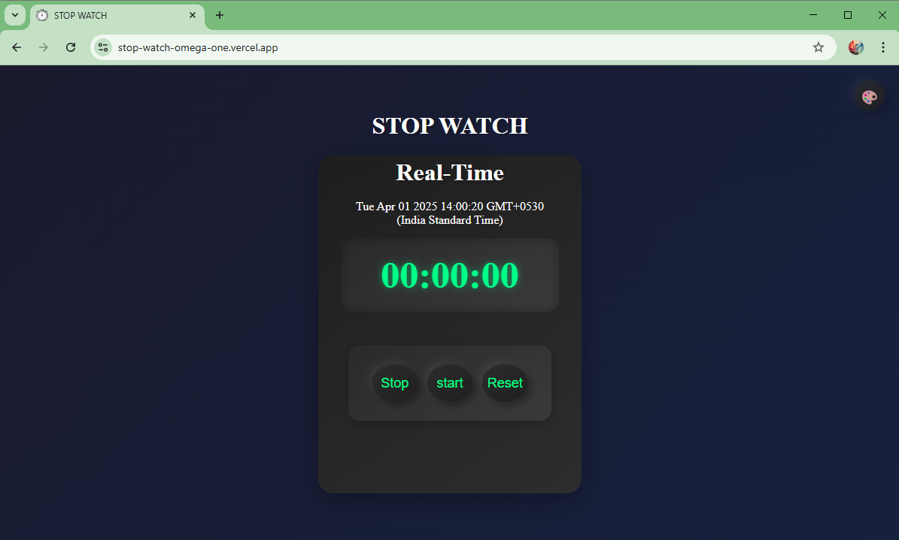
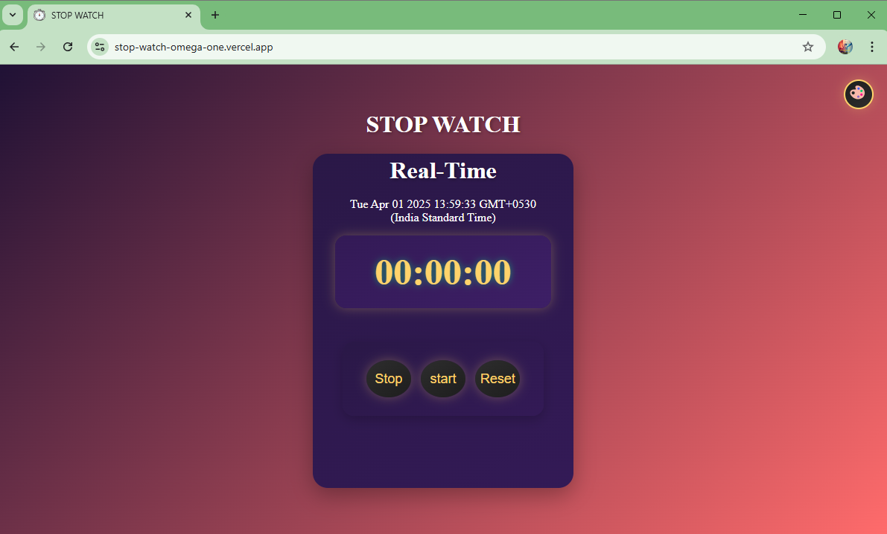

# ⏱️ Stopwatch App with Theme Changer  

A **modern stopwatch app** built using **HTML, CSS, and JavaScript**. It features a **real-time clock** and a **theme switcher** that smoothly transitions to a sunset mode.  

## 🚀 Features  
- ✅ **Real-time clock** updates every 10 milliseconds  
- ✅ **Start, Stop, and Reset stopwatch** functionality  
- ✅ **Theme switcher** with smooth sunset mode transition  
- ✅ **Modern UI** with glassmorphism & gradient effects  

## 🛠️ Tech Stack  
- **HTML** → Structure  
- **CSS** → Styling & animations  
- **JavaScript** → Stopwatch logic & theme switching  

## 🎮 Live Demo  
🔗 **[Try it Here!](https://stop-watch-omega-one.vercel.app/)**  

## 📂 Installation  
1. Clone the repository  
   git clone https://github.com/mohityadavGit/Stop-Watch.git
  
2. Open `index.html` in your browser  

## 📸 Screenshots  
  
  

## 📝 Lessons Learned  
- Handling **setInterval** & **clearInterval** in JavaScript  
- **DOM manipulation** for real-time UI updates  
- Creating **glassmorphism UI** using CSS  
- Implementing a **theme switcher**  

## 🤝 Contributing  
Want to improve this project? Feel free to **fork the repo** and submit a **pull request**! 🚀  

## 📩 Contact  
📧 **Email:** [yadavstuntboy@gmail.com](mailto:yadavstuntboy@gmail.com)  
🔗 **LinkedIn:** [Mohit Yadav](https://www.linkedin.com/in/mohityadav1920/)  
🔗 **GitHub Repo:** [Stopwatch App](https://github.com/mohityadavGit/Stop-Watch.git)  
